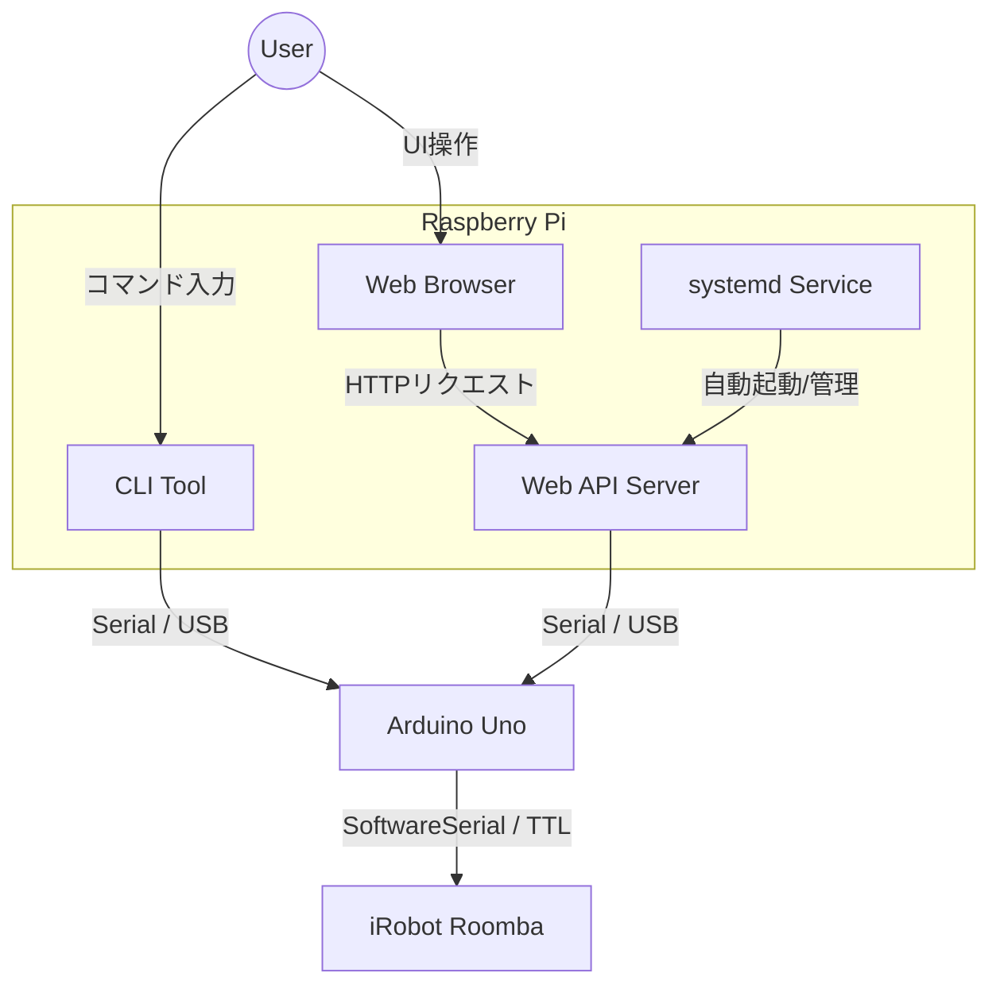

# Roomba Control Project

このプロジェクトは、Arduinoを使用してRoombaを制御するためのシステムです。REST APIまたはCLI経由でRoombaを操作できます。

https://github.com/user-attachments/assets/e16c3681-f285-4850-b774-583d462ea997


## 概要

本システムは、以下のコンポーネントで構成されています。

1.  **Arduinoファームウェア (`roomba.ino`)**:
    -   SoftwareSerialを使用してRoombaと通信します。
    -   PCからのシリアルコマンドを受け取り、RoombaのROI (Roomba Open Interface) コマンドに変換します。
    -   前進、右旋回、左旋回、後退、停止の基本的な動作をサポートします。

2.  **Web APIサーバー (`roomba_api.py`)**:
    -   PythonのFastAPIフレームワークを使用しています。
    -   シリアルポートの検出、接続、切断、およびコマンド送信のためのREST APIエンドポイントを提供します。
    -   静的ファイル (`static/`) を配信し、ブラウザベースのWebインターフェースも提供します。

3.  **CLIツール (`roomba_controller.py`)**:
    -   ターミナルから直接Roombaを制御するためのPythonスクリプトです。
    -   対話モードでキーボード入力によりRoombaを操作できます。

## 必要条件

### ハードウェア
-   Arduino (Uno等)
-   iRobot Roomba (Open Interface対応モデル)
-   PC (ArduinoとUSB接続)
-   適切な接続ケーブル (RoombaのMini-DIN端子とArduinoのRX/TXピンを接続)

### ソフトウェア
-   Python 3.8以上
-   Arduino IDE

## インストール

1.  **Arduinoのセットアップ**:
    -   `roomba.ino` をArduino IDEで開き、Arduinoボードに書き込みます。
    -   配線:
        -   Arduino Pin 10 (RX) -> Roomba TX
        -   Arduino Pin 11 (TX) -> Roomba RX
        -   GND同士を接続

2.  **Python環境のセットアップ**:
    必要なライブラリをインストールします。

    ```bash
    pip install fastapi uvicorn pyserial pydantic
    ```

## 使用方法

### CLIツールでの操作

ターミナルで以下のコマンドを実行します。

```bash
python roomba_controller.py
```
画面の指示に従い、シリアルポートを選択して操作します。

### Web APIサーバーの起動

以下のコマンドでAPIサーバーを起動します。

```bash
python roomba_api.py
```
ブラウザで [http://localhost:8000](http://localhost:8000) にアクセスすると操作画面が表示されます。
APIドキュメントは [http://localhost:8000/docs](http://localhost:8000/docs) で確認できます。

## 技術的詳細 / アーキテクチャ

システム全体のアーキテクチャは以下の通りです。





**Control Flow:**
User (Browser/CLI) -> Python Script (API/Controller) -> Serial (USB) -> Arduino -> SoftwareSerial (TTL) -> Roomba

### 通信プロトコル

**PC -> Arduino:**
1バイトの文字コードを送信して制御します。

-   `'0'` (ASCII 48): 前進 (速度 64, 64)
-   `'1'` (ASCII 49): 右旋回 (速度 64, -64)
-   `'2'` (ASCII 50): 左旋回 (速度 -64, 64)
-   `'3'` (ASCII 51): 後退 (速度 -64, -64)
-   その他: 停止

**Arduino -> Roomba:**
Roomba Open Interface (OI) 仕様に基づき、バイナリデータを送信します。
例: Drive PWM コマンド (Opcode 146) を使用して左右のモーター速度を個別に制御しています。

### ディレクトリ構成

-   `roomba.ino`: Arduino用ソースコード
-   `roomba_api.py`: FastAPIバックエンドサーバー
-   `roomba_controller.py`: CLI操作用スクリプト
-   `static/`: Webフロントエンド用ファイル群
-   `roomba-api.service`: Linux環境での自動起動用Systemdサービスファイル

## Raspberry Pi での運用

本システムはRaspberry Pi上での動作を想定しており、`systemd` を使用してAPIサーバーを自動起動する構成になっています。

### systemd サービスの設定

同梱の `roomba-api.service` を使用してサービスを登録します。

1.  ファイル内のパスを実際の環境に合わせて修正します（例: `WorkingDirectory`, `ExecStart`）。
2.  サービスファイルを配置し、有効化します。

```bash
sudo cp roomba-api.service /etc/systemd/system/
sudo systemctl daemon-reload
sudo systemctl enable roomba-api
sudo systemctl start roomba-api
```

### サービスの状態確認

```bash
sudo systemctl status roomba-api
```

## 注意事項

-   Roombaのボーレートはモデルによって異なりますが、本コードのArduino側は `SoftwareSerial` で `115200` に設定されています。接続するRoombaの設定に合わせて調整が必要な場合があります。
-   APIサーバー実行時、シリアルポートの競合を避けるため、CLIツールやArduino IDEのシリアルモニタは閉じてください。
